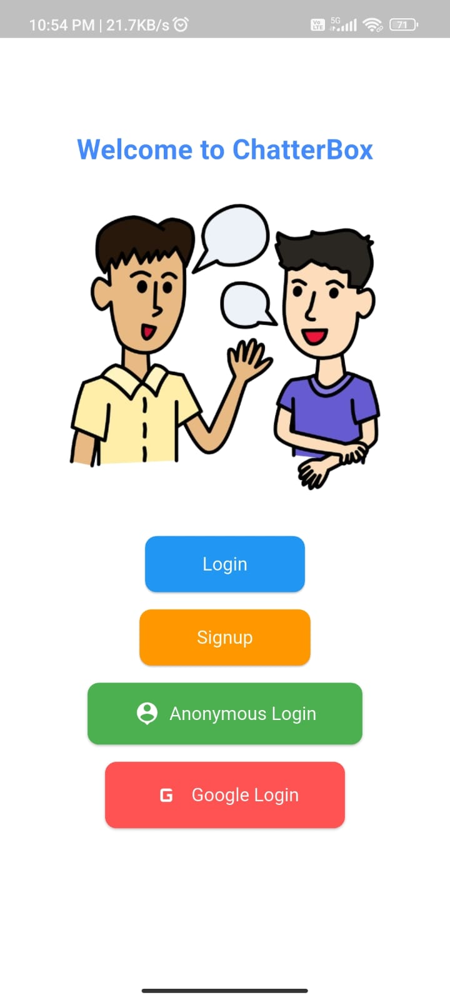
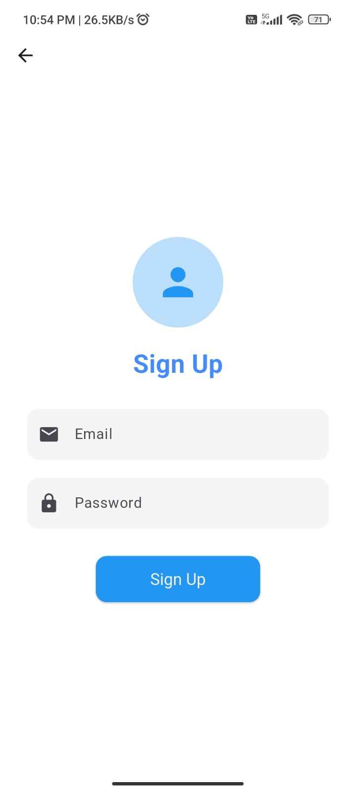
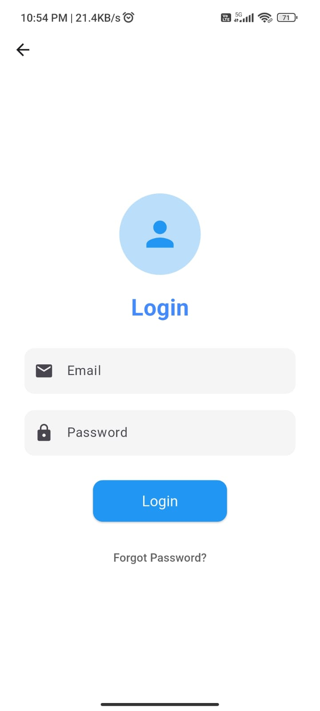
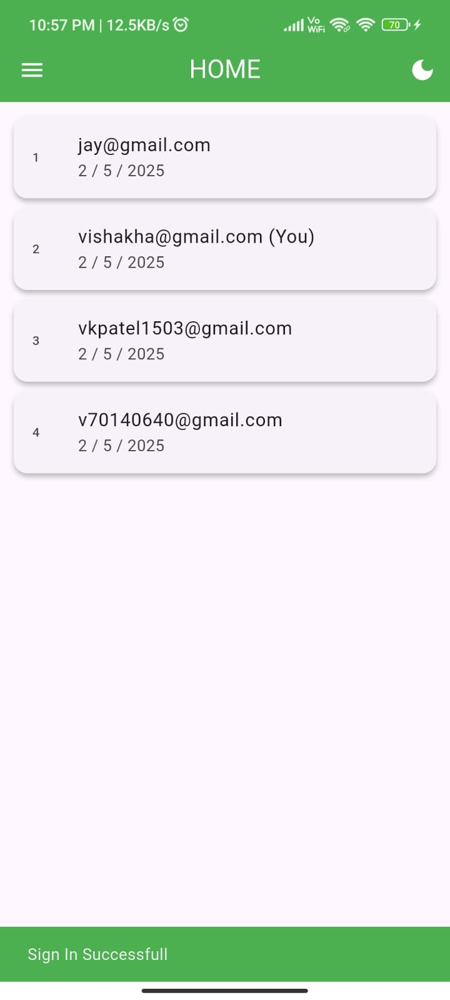
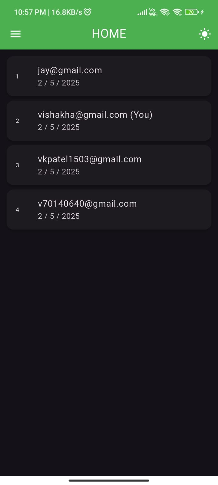
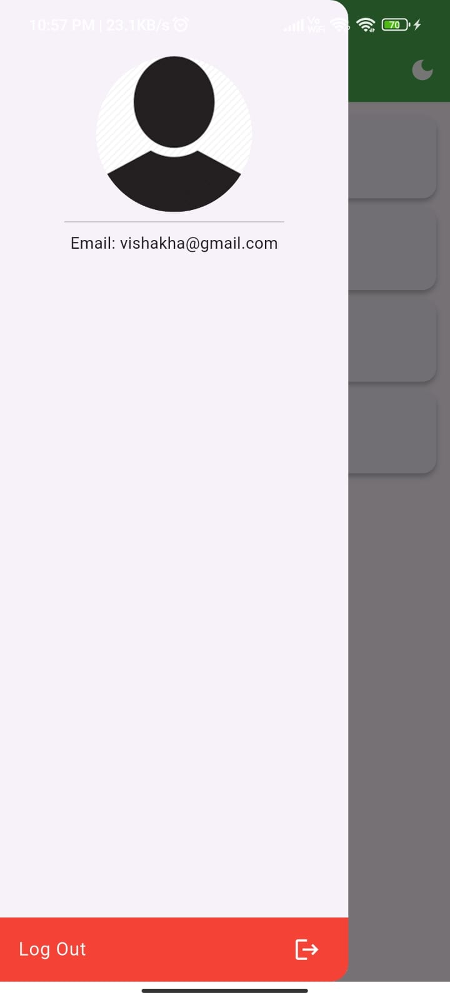
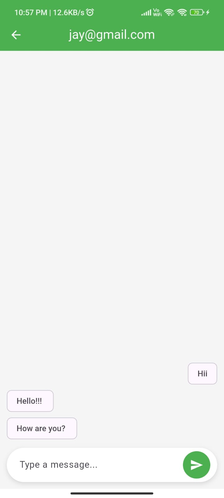

🔥 CHATTERBOX (Chat App)

Firebase Miner is a modern, secure Flutter-based chat application that offers seamless two-way communication. With Firebase Authentication and Firestore integration, the app ensures real-time messaging, user authentication, and data synchronization for a smooth chatting experience.

🚀 Features

🔐 Secure Authentication

Multiple sign-in methods (Email/Password, Google, Guest Sign-in)

Firebase Authentication for secure user access

💬 Real-Time Messaging
Instant message synchronization using Firebase Firestore

One-on-one chat functionality

👤 User Profile Management
Customizable user profiles

Profile picture and status updates

🌙 Light & Dark Theme

Smooth theme switching for better user experience

🎨 Attractive UI

Splash screen with app branding

Clean and intuitive chat interface

📱 Individual Chat Pages

Dedicated chat screens for each conversation

🛠 Tech Stack
Flutter – UI Development

Dart – Programming Language

Firebase Authentication – Secure User Login

Firebase Firestore – Real-Time Database

GetX – State Management 

🔧 Installation
Clone the repository

bash
git clone https://github.com/Vishakha1510/firebase-miner.git
cd firebase-miner
Install dependencies

bash
flutter pub get
Set up Firebase

Add your google-services.json (Android) and GoogleService-Info.plist (iOS)

Configure Firebase Authentication & Firestore

Run the app

bash
flutter run

📸 Screenshots

	

	

	

	

	

	

	

📜 Future Enhancements
Group chats

Media sharing (images, videos)

Push notifications

Message encryption

🤝 Contributing
Contributions are welcome! Open an issue or submit a PR for bug fixes, features, or UI improvements.

